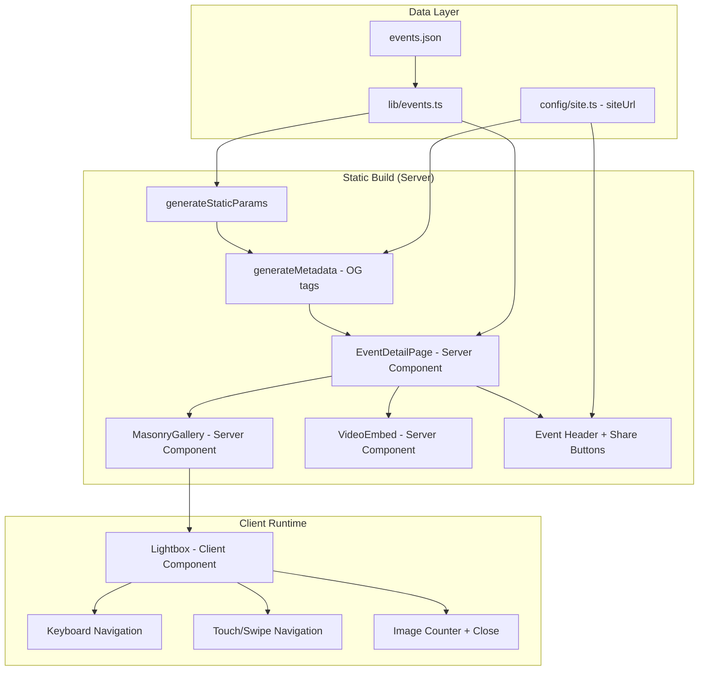
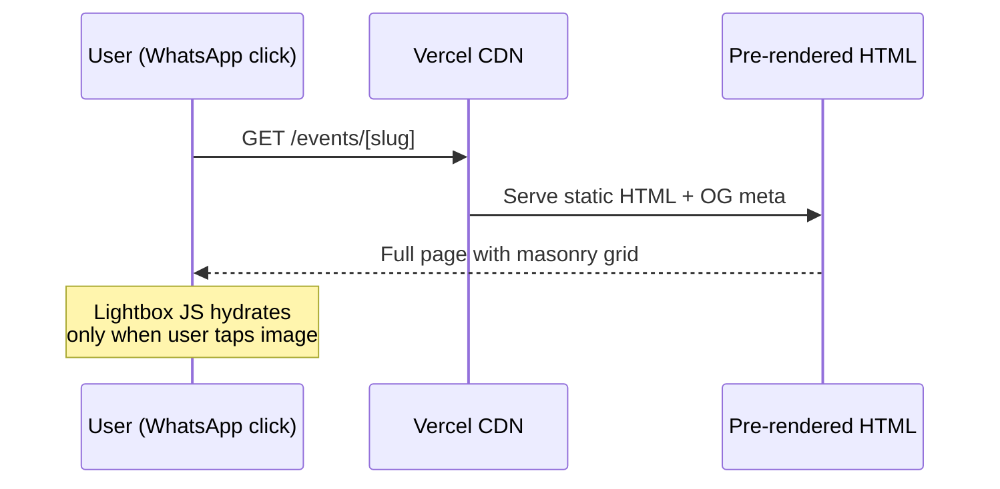
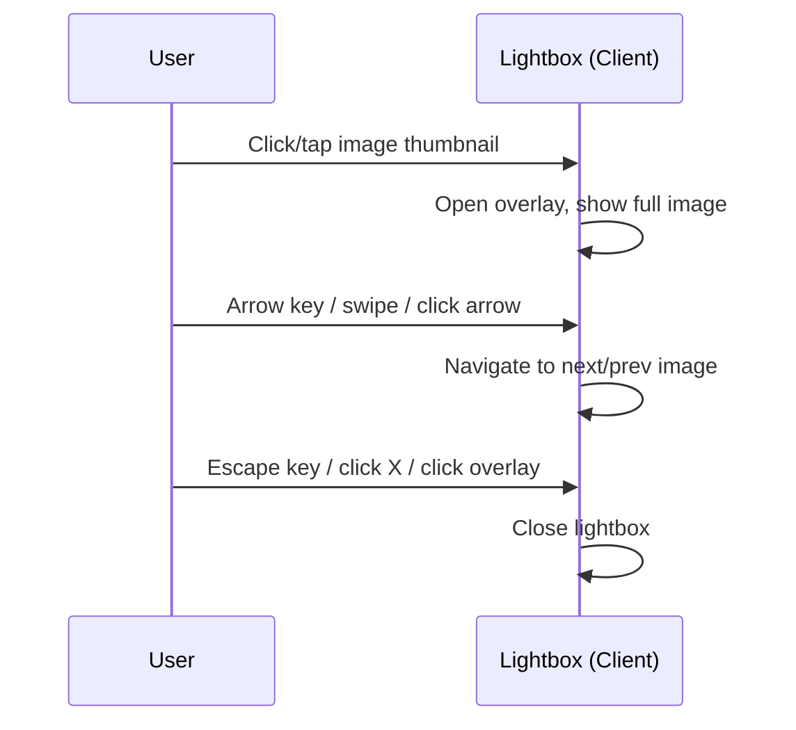
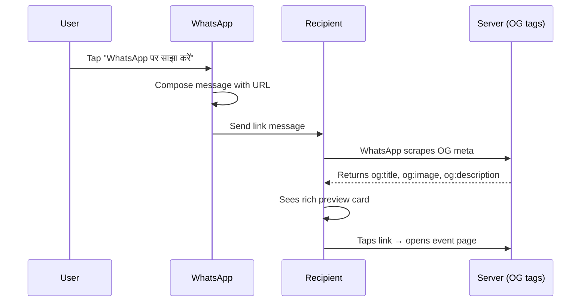

# Design Document: Event Gallery Page Rebuild

## Overview

The event detail page (`app/events/[slug]/page.tsx`) is being rebuilt to support large photo galleries (50+ images), embedded videos, and a fullscreen lightbox experience. The primary audience arrives via WhatsApp links on mobile devices, so the page must generate proper Open Graph meta tags that render a rich link preview (event title + thumbnail image).

The architecture splits into a Server Component (page shell, metadata, gallery grid) and a single Client Component (lightbox modal with keyboard/swipe navigation). Videos are embedded inline within the masonry grid. Data schema expands to include a `videos` array. The `EventCard` component's share button is updated to share the event page URL rather than raw text.

## Architecture



## Sequence Diagrams

### Page Load Flow (Static)



### Lightbox Interaction



### WhatsApp Share Flow



## Components and Interfaces

### Component 1: EventDetailPage (Server Component)

**Purpose**: Page shell that reads event data at build time, renders header, gallery, and videos.

**Interface**:
```typescript
// app/events/[slug]/page.tsx
interface PageProps {
  params: { slug: string };
}

export default function EventDetailPage({ params }: PageProps): JSX.Element
export async function generateMetadata({ params }: PageProps): Promise<Metadata>
export async function generateStaticParams(): Promise<{ slug: string }[]>
```

**Responsibilities**:
- Generate static params for all events
- Produce OG metadata (title, description, image) for WhatsApp previews
- Render event header (title, date, share buttons)
- Render masonry grid of images
- Render video embeds below gallery
- Pass image list to Lightbox client component

### Component 2: Lightbox (Client Component)

**Purpose**: Fullscreen image viewer with navigation. Only hydrates on user interaction.

**Interface**:
```typescript
// components/Lightbox.tsx
"use client";

interface LightboxProps {
  images: { src: string; alt: string }[];
  initialIndex: number;
  onClose: () => void;
}

export default function Lightbox({ images, initialIndex, onClose }: LightboxProps): JSX.Element | null
```

**Responsibilities**:
- Render fullscreen dark overlay (bg-black/95)
- Display current image with counter ("3 / 24")
- Handle left/right navigation (keyboard ArrowLeft/ArrowRight, click arrows, touch swipe)
- Handle close (Escape key, X button, overlay click)
- Prevent body scroll when open
- Preload adjacent images for smooth navigation

### Component 3: GalleryTrigger (Client Component — minimal)

**Purpose**: Wraps each image thumbnail to handle click-to-open lightbox. Keeps the gallery grid itself as a Server Component pattern while enabling interaction.

**Interface**:
```typescript
// components/GalleryGrid.tsx
"use client";

interface GalleryGridProps {
  images: { src: string; alt: string }[];
}

export default function GalleryGrid({ images }: GalleryGridProps): JSX.Element
```

**Responsibilities**:
- Render masonry grid using CSS columns
- Track selected image index state
- Open/close Lightbox on image click
- Render image thumbnails with lazy loading

### Component 4: VideoEmbed (Server Component)

**Purpose**: Renders YouTube iframes or HTML5 video players for event videos.

**Interface**:
```typescript
// components/VideoEmbed.tsx
interface VideoEmbedProps {
  url: string; // YouTube URL or path to MP4 in /public/events/
}

export default function VideoEmbed({ url }: VideoEmbedProps): JSX.Element
```

**Responsibilities**:
- Detect if URL is YouTube (iframe embed) or MP4 (HTML5 video tag)
- Render responsive container with fixed aspect ratio (16:9)
- Add `loading="lazy"` for below-fold performance
- YouTube: use youtube-nocookie.com domain for privacy

## Data Models

### TrustEvent (updated)

```typescript
// lib/events.ts
export interface TrustEvent {
  title: string;
  date: string;          // ISO yyyy-mm-dd
  description: string;
  images: string[];      // filenames in /public/events/
  videos: string[];      // YouTube URLs or MP4 filenames in /public/events/
}
```

**Validation Rules**:
- `title` is non-empty string
- `date` is valid ISO date string
- `description` is non-empty string
- `images` is array (can be empty)
- `videos` is array (can be empty, defaults to `[]` for backward compatibility)

### events.json Schema (updated)

```typescript
// data/events.json shape
type EventsData = Array<{
  title: string;
  date: string;
  description: string;
  images: string[];
  videos: string[];  // NEW: YouTube URLs or "filename.mp4"
}>
```

### config/site.ts Addition

```typescript
// Add to siteConfig object:
siteUrl: "http://localhost:3000", // swap to production domain when ready
```

## Algorithmic Pseudocode

### Masonry Grid Layout Algorithm

```typescript
// CSS-only masonry via CSS columns — no JS layout calculation needed.
// The browser handles item placement via column-count + break-inside: avoid.

// Tailwind classes applied to container:
// "columns-2 sm:columns-3 lg:columns-4 gap-3"

// Each item:
// "mb-3 break-inside-avoid overflow-hidden rounded-xl"

// This renders items top-to-bottom in each column,
// respecting natural aspect ratios (no fixed height).
```

### Video URL Detection Algorithm

```typescript
function isYouTubeUrl(url: string): boolean {
  return url.includes("youtube.com") || url.includes("youtu.be");
}

function getYouTubeEmbedUrl(url: string): string {
  // Extract video ID from various YouTube URL formats
  const patterns = [
    /(?:youtube\.com\/watch\?v=)([^&]+)/,
    /(?:youtu\.be\/)([^?]+)/,
    /(?:youtube\.com\/embed\/)([^?]+)/,
  ];

  for (const pattern of patterns) {
    const match = url.match(pattern);
    if (match) return `https://www.youtube-nocookie.com/embed/${match[1]}`;
  }

  return url; // fallback: return as-is
}

function isMp4File(url: string): boolean {
  return url.endsWith(".mp4");
}
```

### Lightbox Navigation Algorithm

```typescript
// State management within Lightbox client component:
function navigateLightbox(
  currentIndex: number,
  direction: "next" | "prev",
  totalImages: number
): number {
  if (direction === "next") {
    return (currentIndex + 1) % totalImages; // wrap around
  }
  return (currentIndex - 1 + totalImages) % totalImages; // wrap around
}

// Touch swipe detection:
function detectSwipe(touchStartX: number, touchEndX: number): "next" | "prev" | null {
  const threshold = 50; // minimum px distance for swipe
  const diff = touchStartX - touchEndX;

  if (Math.abs(diff) < threshold) return null;
  return diff > 0 ? "next" : "prev"; // swipe left = next, swipe right = prev
}
```

### OG Metadata Generation

```typescript
// In generateMetadata():
function buildEventMetadata(event: TrustEvent, slug: string): Metadata {
  const ogImage = event.images.length > 0
    ? `${siteConfig.siteUrl}/events/${event.images[0]}`
    : `${siteConfig.siteUrl}/og-default.jpg`;

  return {
    title: event.title,
    description: event.description,
    openGraph: {
      title: event.title,
      description: event.description,
      type: "article",
      url: `${siteConfig.siteUrl}/events/${slug}`,
      images: [{ url: ogImage, width: 1200, height: 630, alt: event.title }],
    },
  };
}
```

## Key Functions with Formal Specifications

### Function 1: generateMetadata()

```typescript
export async function generateMetadata({ params }: PageProps): Promise<Metadata>
```

**Preconditions:**
- `params.slug` is a non-empty string
- `getEventBySlug(params.slug)` may return null (event not found)
- `siteConfig.siteUrl` is a valid URL string

**Postconditions:**
- If event found: returns Metadata with `og:title`, `og:description`, `og:image`, `og:url`
- If event not found: returns fallback title "कार्यक्रम नहीं मिला"
- `og:image` uses first image from event, or default fallback image

### Function 2: Lightbox navigation handlers

```typescript
function handleKeyDown(e: KeyboardEvent): void
function handleTouchStart(e: TouchEvent): void
function handleTouchEnd(e: TouchEvent): void
```

**Preconditions:**
- Lightbox is currently open (mounted in DOM)
- `images` array has at least 1 element
- `currentIndex` is in range [0, images.length - 1]

**Postconditions:**
- ArrowRight/SwipeLeft → `currentIndex` increments (wraps at end)
- ArrowLeft/SwipeRight → `currentIndex` decrements (wraps at start)
- Escape → `onClose()` called, lightbox unmounts
- Body scroll is prevented while open, restored on close

### Function 3: getEventShareUrl()

```typescript
function getEventShareUrl(event: TrustEvent): string
```

**Preconditions:**
- `event` has valid `title` and `date` fields
- `siteConfig.siteUrl` is set
- `getEventSlug(event)` returns a valid slug string

**Postconditions:**
- Returns full URL: `${siteConfig.siteUrl}/events/${slug}`
- URL is suitable for WhatsApp sharing (plain URL, no encoding needed for the link itself)

## Example Usage

```typescript
// 1. Event data with videos (events.json entry)
{
  "title": "हनुमान जन्मोत्सव 2026",
  "date": "2026-04-02",
  "description": "श्री हनुमान जी के जन्मोत्सव...",
  "images": ["janmotsav-1.jpg", "janmotsav-2.jpg", ...],
  "videos": ["https://youtube.com/watch?v=abc123", "event-highlights.mp4"]
}

// 2. Server Component renders gallery grid
<GalleryGrid
  images={event.images.map((img, i) => ({
    src: `/events/${img}`,
    alt: `${event.title} — फोटो ${i + 1}`,
  }))}
/>

// 3. Video embeds render below gallery
{event.videos.map((video) => (
  <VideoEmbed key={video} url={video} />
))}

// 4. WhatsApp share uses page URL for rich preview
const shareUrl = `${siteConfig.siteUrl}/events/${getEventSlug(event)}`;
const waShareLink = `https://wa.me/?text=${encodeURIComponent(shareUrl)}`;

// 5. EventCard share button (updated)
<a href={`https://wa.me/?text=${encodeURIComponent(shareUrl)}`}>
  WhatsApp पर साझा करें
</a>
```

## Correctness Properties

### Property 1: Lightbox index always in bounds
After any navigation action, currentIndex satisfies 0 <= currentIndex < images.length

### Property 2: OG image URL is always absolute
For any event with images, the og:image meta tag value starts with siteConfig.siteUrl

### Property 3: Videos field backward compatible
For any event without a "videos" key in the JSON, the system defaults to an empty array with no runtime errors

### Property 4: Lightbox body scroll lock
When lightbox opens, document.body.style.overflow is set to "hidden". When lightbox closes, it is restored to its previous value.

### Property 5: WhatsApp share URL matches OG URL
The URL shared via WhatsApp equals the metadata.openGraph.url value, ensuring the preview matches the destination.

### Property 6: Static params completeness
Every event in events.json has a corresponding entry in generateStaticParams output.

## Error Handling

### Error Scenario 1: Event Not Found

**Condition**: `getEventBySlug(slug)` returns null (invalid/stale slug)
**Response**: Call `notFound()` → renders Next.js 404 page
**Recovery**: User sees "कार्यक्रम नहीं मिला" with link back to events listing

### Error Scenario 2: Missing Videos Field (Backward Compatibility)

**Condition**: Existing events in `events.json` don't have `videos` field
**Response**: Default to empty array via `event.videos ?? []`
**Recovery**: No runtime error; videos section simply doesn't render

### Error Scenario 3: Invalid YouTube URL

**Condition**: URL in videos array doesn't match known YouTube patterns
**Response**: `getYouTubeEmbedUrl()` returns the URL as-is (iframe may fail gracefully)
**Recovery**: Browser shows iframe load error; doesn't break page layout

### Error Scenario 4: Image Fails to Load

**Condition**: Image file missing from `/public/events/`
**Response**: Browser shows broken image indicator within the masonry cell
**Recovery**: Masonry layout remains intact (CSS columns handle missing items); alt text visible

## Testing Strategy

### Unit Testing Approach

- `getYouTubeEmbedUrl()`: Test with various YouTube URL formats (watch, short, embed)
- `isMp4File()`: Test with .mp4, .MP4, non-mp4 extensions
- `getEventSlug()`: Ensure Hindi titles produce valid URL slugs
- `navigateLightbox()`: Test wrap-around behavior at boundaries
- `detectSwipe()`: Test threshold detection with various distances

### Property-Based Testing Approach

**Property Test Library**: Vitest with manual generators (no external prop-test library needed)

- Lightbox index always stays in [0, N-1] after any sequence of next/prev
- All generated slugs are valid URL segments (no special characters)
- OG image URLs are always absolute (start with http)

### Integration Testing Approach

- Build test: `npm run build` must succeed with updated data schema
- Static params: All events produce pages (no 404 for known slugs)
- Visual: Manual check on mobile viewport for masonry layout

## Performance Considerations

- **CSS columns masonry**: Zero JS layout cost. Browser handles column distribution natively.
- **Lazy loading**: All images below fold use native `loading="lazy"`. First 4 images above fold load eagerly.
- **Lightbox code-split**: `GalleryGrid` (which includes Lightbox) is a client component, but it's minimal JS. The page shell remains a Server Component.
- **YouTube nocookie**: Uses `youtube-nocookie.com` to avoid third-party cookie overhead.
- **No layout shift**: Masonry items use `break-inside-avoid` + `overflow-hidden` + natural aspect ratio. Video embeds use `aspect-video` (16:9) wrapper.
- **50+ images**: CSS columns handle any number of items efficiently. No virtual scrolling needed since images are lazy-loaded by the browser.
- **Image preloading in lightbox**: Only preloads `currentIndex ± 1` images to avoid bandwidth waste.

## Security Considerations

- YouTube embeds use `youtube-nocookie.com` for enhanced privacy
- Self-hosted MP4 videos served from same origin (`/public/events/`) — no CORS issues
- WhatsApp share links use `https://wa.me/` (official WhatsApp domain)
- No user-generated content; all data is trusted (JSON files checked into repo)
- iframe embeds have no `allow` attribute beyond defaults (no camera/mic access)

## Dependencies

- **No new npm dependencies** — implementation uses only:
  - Next.js 14 built-ins (App Router, Metadata API, `next/dynamic`)
  - React hooks (`useState`, `useEffect`, `useCallback`)
  - Tailwind CSS utilities (columns, break-inside-avoid, aspect-video)
  - Native browser APIs (KeyboardEvent, TouchEvent, `document.body.style`)
- **Data**: `data/events.json` (updated schema with `videos` field)
- **Config**: `config/site.ts` (new `siteUrl` field)
